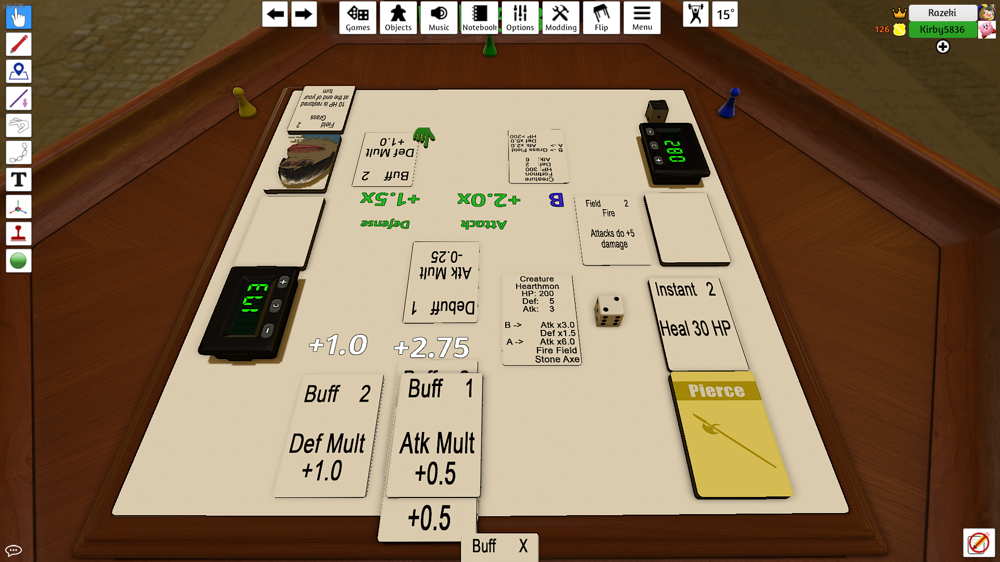

*(As a sidenote, this post was created a couple weeks after we started, so some info might be missing)*

# Bringing Everyone Together
Each of us spent time the past week developing bare-bones prototypes for our combat system. Each was very different, not only in terms of mechanics, but also in terms of how the prototypes were created.

+ David K created a document with the rules and mechanics of his game, and he thoroughly explained his concept to us instead of playing it with us.

+ David L created a Unity prototype of his game. This made sense, since his prototype was very much focused on real-time interactions with the opponent.

+ Nate's prototype was a paper prototype which he created within a basic set of core mechanics. He also built the deck in Tabletop Simulator in order to play it with the rest of the team while explaining it.

Each prototype had similar mechanics, such as turn phases (Draw, Attack, End, etc), but there were also lots of differences. We decided that as a base game, Nate's prototype was the best choice for building off of; it was simple enough to allow for freedom in mechanic development, and it was easy to incorporate good aspects of the other two prototypes into it.

Finally, we set up a plan for the following week. We wanted to give some more definition to our game, so we wanted to focus on building up your board in order to deal more damage, evolve, etc. The best way to frame this was to have an environment that you fill up with objects, and we went from there.

Here is the Must Do's we had for this week:
+ Add a defending system during an opponent's attack
+ Add Environmental effects
    + Objects that can be placed
    + Effects on the player/cards/etc
+ A kind of "Mana" system, where actions are limited per turn
+ Create/Modify/Remove Cards
+ Create a game editor tool

The **game editor** was very important, since we wanted an easy way to create and store cards for the game. We chose to create a web application, since it would allow for a database backend to store cards, and it is easily accessible. Nate was tasked with building the tool, since he has the most (full stack) web experience.

We also settled on a game setting, and some baseline deck building guidelines.

Then we tasked each person to build a deck for our next meeting, so we can start testing out mechanics.

**Written By: Nate Glick**